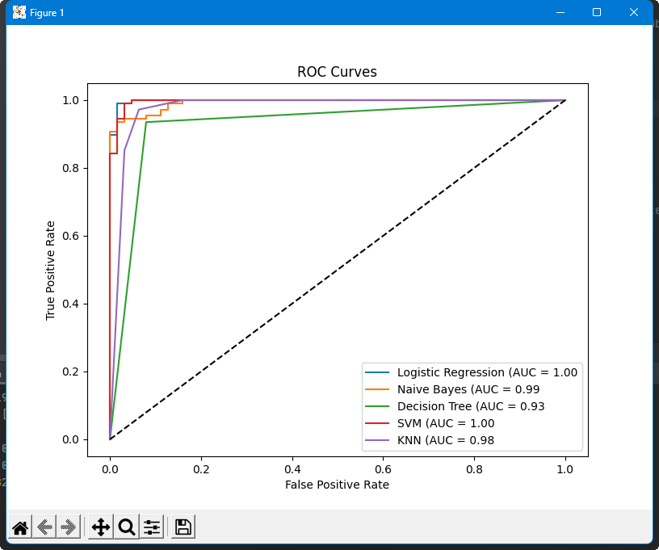
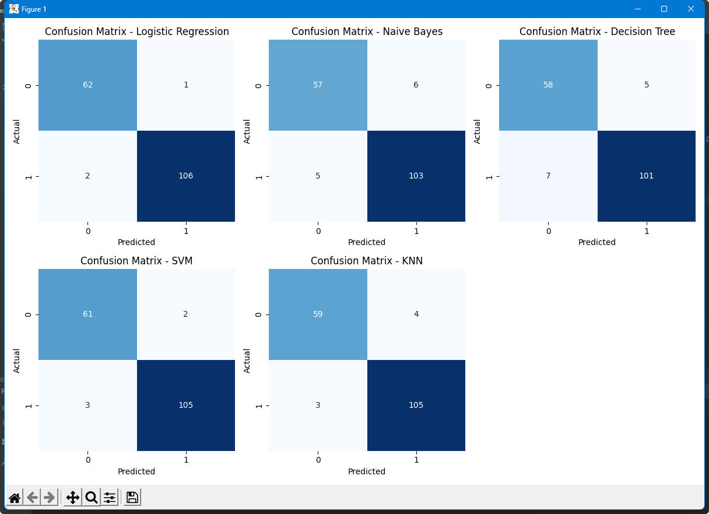
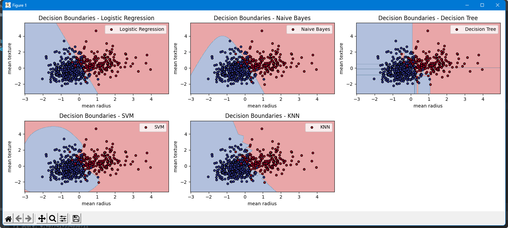
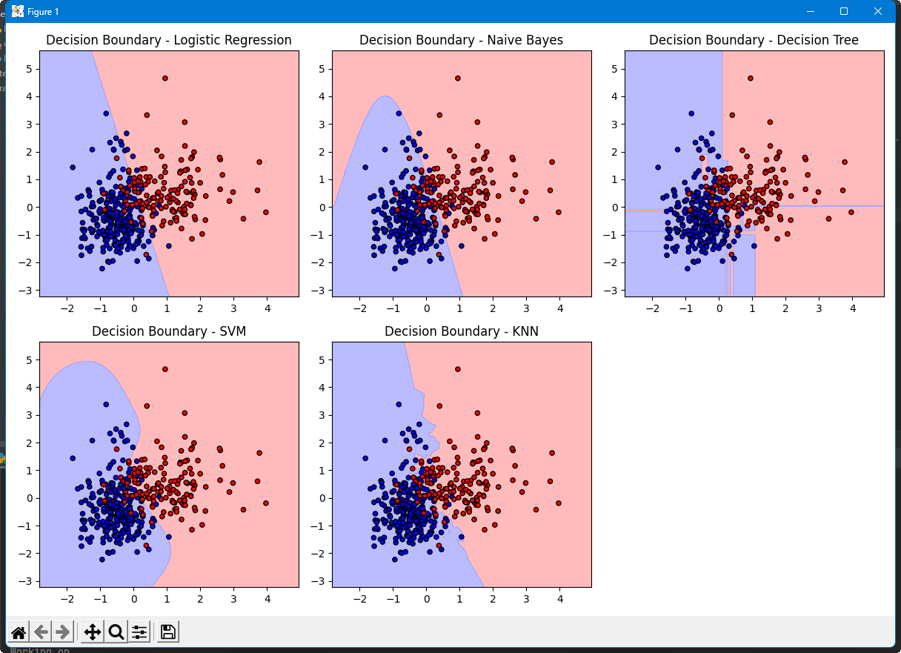

# Breast Cancer Classification with Multiple ML Algorithms

A comprehensive machine learning project for **classification of breast cancer** (benign vs malignant) using the Breast Cancer Wisconsin dataset.
The script demonstrates preprocessing, feature scaling, model training, evaluation, visualization, and hyperparameter tuning across multiple algorithms.

---

## 📚 Features

- Loads and explores the Breast Cancer Wisconsin dataset (built-in from sklearn).
- Checks and handles missing values.
- Scales features for fair comparison.
- Implements and evaluates:
  - Logistic Regression
  - Naive Bayes
  - Decision Tree
  - Support Vector Machine (SVM)
  - K-Nearest Neighbors (KNN)
- Outputs accuracy, precision, recall, F1 score, confusion matrix, ROC curve, and AUC for each model.
- Visualizes:
  - ROC curves for all classifiers
  - Confusion matrices as heatmaps
  - Decision boundaries in 2D feature space (selectable features)
- Performs hyperparameter tuning (GridSearchCV) for improved model performance.
- Well-commented and easy to modify/extend.

---

## 🚀 Setup & Installation

1. **Clone the repository:**
    ```bash
    git clone https://github.com/your-username/breast-cancer-ml-comparison.git
    cd breast-cancer-ml-comparison
    ```

2. **Install requirements:**
    ```bash
    pip install -r requirements.txt
    ```
    *Or manually:*
    ```bash
    pip install numpy pandas scikit-learn matplotlib seaborn
    ```

---

## 🕹️ Usage

Simply run the script:

```bash
python breast_cancer_ml.py
```

*You can easily modify the script to test other datasets or classification tasks.*

---

## 📊 Example Outputs

### 1. ROC Curves for All Models

Shows the True Positive Rate vs False Positive Rate for each classifier (the higher the curve, the better):



---

### 2. Confusion Matrices as Heatmaps

Each classifier's performance on test data, with counts of True/False Positives/Negatives:



---

### 3. Decision Boundaries (Scatter Plots)

Visualizes how each algorithm separates classes in the feature space ("mean radius" vs "mean texture"):



---

### 4. Decision Boundaries (Square Plots)

A focused look at the learned class separation by each model:



---

## 📝 Notes

- The dataset is automatically loaded from scikit-learn (`sklearn.datasets`).
- Change `feature1_name` and `feature2_name` to visualize decision boundaries for different feature pairs.
- Hyperparameter tuning is performed for all models except Naive Bayes.
- Script can be adapted for other binary classification datasets.

---

## 📦 Requirements

- numpy
- pandas
- scikit-learn
- matplotlib
- seaborn

---

## 🧑‍💻 Author

- [Zein Al Haffei](https://github.com/your-username)

---

## 📄 License

This project is licensed under the [MIT License](LICENSE).

---

*Educational project for comparative machine learning and biomedical data science.*

